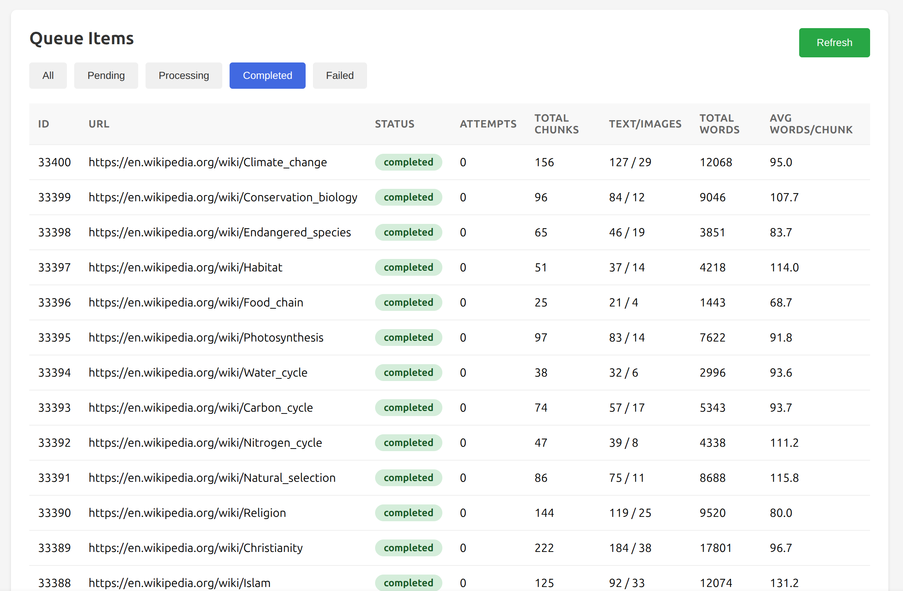
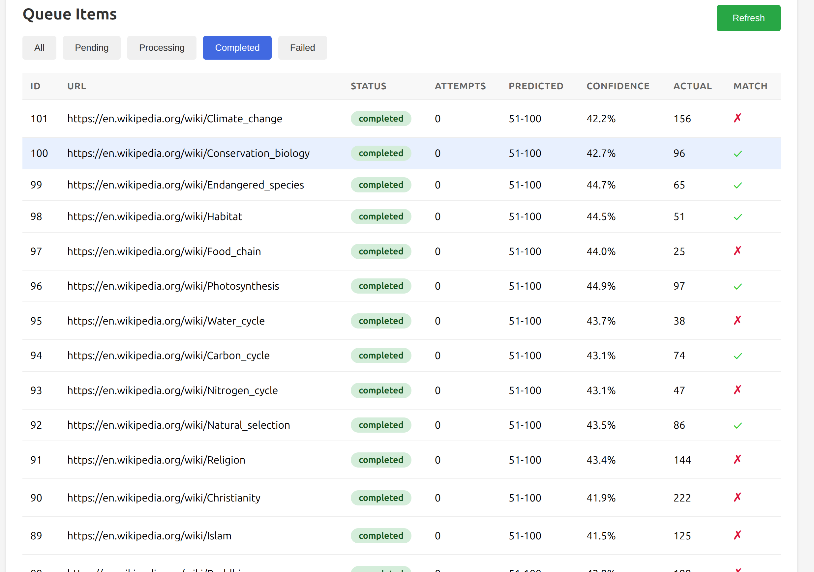
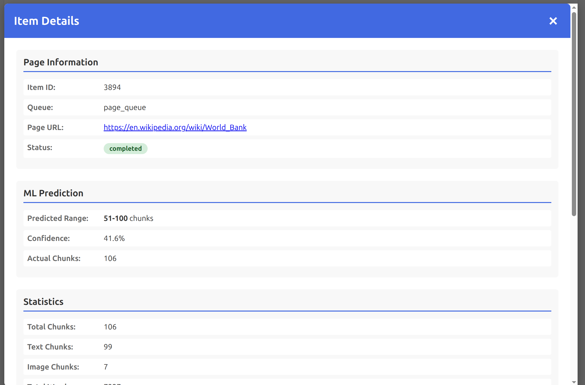
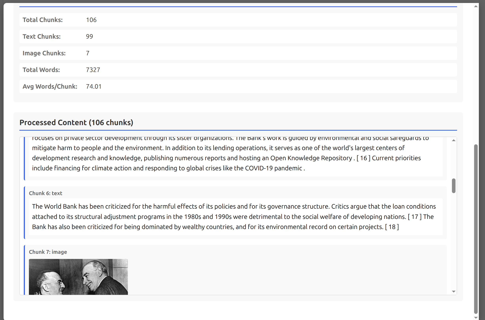

# Queue Processor - Web Page to Interleaved Content

A prototype implementation of the "dataset as a queue" pattern for processing web pages into interleaved image/text content.

## Overview

This system implements a multi-stage queue-based architecture for:
- Downloading web pages
- Extracting interleaved text and image content
- Computing statistics on processed content
- Training ML models to predict content complexity
- Running inference on new content
- Managing the processing pipeline via a web interface

The system supports multiple queues for different processing stages, allowing for sophisticated data processing pipelines with machine learning integration.

## Architecture

The system consists of several components:

1. **SQLite Queue Backend** - Durable multi-queue system with visibility timeout and retry logic
2. **Page Worker** - Processes web pages into interleaved content (stage 1)
3. **Stats Worker** - Computes statistics on processed pages (stage 2)
4. **ML Worker** - Trains models and runs inference to predict content complexity (stage 3)
5. **FastAPI Backend** - REST API for multi-queue management
6. **Frontend UI** - Web interface for monitoring and adding items with queue-specific views
7. **Puller** - Example consumer that reads processed results

### Multi-Stage Pipeline

The system supports multiple independent queues for different processing stages:

- **page_queue** (Stage 1): Web pages → Interleaved content (text + images)
- **stats_queue** (Stage 2): Processed pages → Statistics (word counts, image metrics)
- **ml_queue** (Stage 3): Processed pages → ML predictions (chunk count classification)

Each queue maintains independent status tracking, allowing for complex data processing workflows with machine learning integration.

## Installation

This project uses `uv` for package management.

```bash
# Dependencies are already installed in .venv
# To activate the virtual environment:
source .venv/bin/activate

# Or run commands directly with uv:
uv run <command>
```

## Usage

### 1. Start the Backend API

```bash
uv run python -m queue_processor.api
```

The API will be available at `http://localhost:8000`

### 2. Start the Page Worker (in a separate terminal)

```bash
# Single-threaded worker
uv run python -m queue_processor.worker

# Multi-threaded worker (4 threads for faster processing)
uv run python -m queue_processor.worker --threads 4
```

The worker will poll the page_queue and process items as they become available. Using multiple threads provides significant speedup for I/O-bound web scraping.

### 3. (Optional) Start the Stats Worker

```bash
# Continuous stats worker - processes completed items every 10 seconds
uv run python -m queue_processor.stats_worker \
  --source-queue page_queue \
  --target-queue stats_queue \
  --interval 10

# Process once and exit
uv run python -m queue_processor.stats_worker --once
```

The stats worker computes statistics from completed page processing results:
- Average words per text chunk
- Average image URL length
- Total word counts
- Chunk distribution (text vs image)
- Min/max values

### 4. (Optional) ML Worker - Train and Predict

The ML worker trains transformer models to predict content complexity (chunk count) from processed page JSON.

#### Training Mode

Train a model on completed items (requires wandb login):

```bash
# Login to Weights & Biases for experiment tracking
wandb login

# Train on 1000 items with 40 training steps
uv run python -m queue_processor.ml_worker \
  --once \
  --min-examples 50 \
  --batch-size 1 \
  --max-steps 40 \
  --model-dir models/chunk_predictor
```

Training features:
- Uses DistilBERT for sequence classification
- 5-bin classification: 0-20, 21-50, 51-100, 101-200, 200+ chunks
- Weights & Biases integration for experiment tracking
- Saves model to disk for later inference

#### Inference Mode

Run predictions on new items using the trained model:

```bash
# Process 100 items from page_queue and save predictions to ml_queue
uv run python -m queue_processor.ml_worker \
  --inference \
  --batch-size 100 \
  --model-dir models/chunk_predictor
```

Predictions include:
- Predicted chunk range (e.g., "51-100")
- Confidence score (0-1)
- Class probabilities for all 5 bins
- Actual chunk count for comparison

### 5. Access the Web UI

Open your browser to:
- Frontend UI: `http://localhost:8000/ui`
- API docs: `http://localhost:8000/docs`

The UI supports all three queues - use the dropdown to switch between:
- **Page Queue (Stage 1)**: View processing status and chunk counts
- **Stats Queue (Stage 2)**: View detailed statistics (text/images, words, averages)
- **ML Queue (Stage 3)**: View predictions with confidence scores and accuracy indicators

## Screenshots

### Page Queue View
The main queue view shows all processed web pages with their status and chunk counts:


### Page Queue Table
Detailed table view showing processing status, URLs, and metadata for all items:


### Stats Queue View
Statistics view displays computed metrics including text/image distribution and word counts:



### ML Queue View
Machine learning predictions with confidence scores and accuracy indicators:



### Item Details Modal
Click any item to view comprehensive details across all processing stages - original page link, interleaved content, statistics, and ML predictions:



### Interleaved Content Display
The processed content is rendered as HTML with text and images in their original document order:



### 6. Add Items to the Queue

#### Via Web UI
1. Go to `http://localhost:8000/ui`
2. Use the "Add Item to Queue" form to add a single URL
3. Or upload a CSV file with a `url` column

#### Via API
```bash
curl -X POST http://localhost:8000/api/items \
  -H "Content-Type: application/json" \
  -d '{"page_url": "https://example.com"}'
```

#### Via CSV
```bash
curl -X POST http://localhost:8000/api/upload \
  -F "file=@example_urls.csv"
```

### 7. Use the Puller to View Results

```bash
# View summary of all completed items
uv run python -m queue_processor.puller

# View details of a specific item
uv run python -m queue_processor.puller --item-id 1
```

### 8. (Optional) Use Apache Beam for Parallel Processing

For faster batch processing, use the Beam worker with multiple parallel workers and streaming pull:

```bash
# Process with 4 parallel workers, 4 threads each, streaming pull
uv run python -m queue_processor.beam_worker --workers 4 --threads 4 --batch-size 10

# Process with 8 workers for even faster throughput
uv run python -m queue_processor.beam_worker --workers 8 --threads 4 --batch-size 10
```

The Beam worker now uses **streaming pull** architecture:
- Pulls small batches (10 items) on-demand instead of loading all items upfront
- Multiple pullers (2x workers) operate in parallel for better throughput
- Resilient to crashes - only ~10-30 items affected instead of thousands
- Combines process-level parallelism (workers) with thread-level concurrency (threads)

See [Beam Performance Report](beam_performance_report.md) for detailed benchmark results showing **3.5x speedup** with 4 workers.

## Queue Workflow

### Multi-Stage Pipeline

```
+----------------+
| Add URLs       |
| (UI/API/CSV)   |
+-------+--------+
        |
        v
+-------+--------+         Stage 1: Page Processing
| page_queue     |
| (SQLite)       |
+-------+--------+
        |
        v
+-------+--------+
| Page Worker    |
| - Download     |
| - Extract      |
| - Interleave   |
+-------+--------+
        |
        v
+-------+--------+
| JSON Files     |
| processed_*.   |
+-------+--------+
        |
        +--------------+
        |              |
        v              v
+-------+--------+   +-------+--------+   Stage 2 & 3
| stats_queue    |   | ml_queue       |
| (SQLite)       |   | (SQLite)       |
+-------+--------+   +-------+--------+
        |                    |
        v                    v
+-------+--------+   +-------+--------+
| Stats Worker   |   | ML Worker      |
| - Compute      |   | - Train        |
| - Aggregate    |   | - Predict      |
| - Save         |   | - Evaluate     |
+-------+--------+   +-------+--------+
        |                    |
        v                    v
+-------+--------+   +-------+--------+
| Stats Files    |   | Predictions    |
| stats_*.json   |   | (in ml_queue)  |
+-------+--------+   +-------+--------+
        |                    |
        +----------+---------+
                   |
                   v
           +-------+--------+
           | Web UI         |
           | - View Stats   |
           | - View ML      |
           | - Compare      |
           +----------------+
```

Each stage operates independently with its own queue, allowing for flexible scaling and fault isolation. Stages 2 and 3 (stats and ML) can run in parallel.

## Data Format

### Processed Pages (data/processed_*.json)

Processed pages are saved as JSON files with the following structure:

```json
{
  "page_url": "https://example.com/article",
  "chunks": [
    {
      "type": "text",
      "value": "This is a paragraph of text content..."
    },
    {
      "type": "image",
      "value": "https://example.com/images/photo.jpg"
    },
    {
      "type": "text",
      "value": "More text content follows the image..."
    }
  ],
  "metadata": {
    "processed_at": 1731640000,
    "num_chunks": 3,
    "num_images": 1,
    "num_text": 2
  }
}
```

### Statistics (data/stats/stats_*.json)

Statistics files contain computed metrics from processed pages:

```json
{
  "page_url": "https://example.com/article",
  "total_chunks": 141,
  "text_chunks": 117,
  "image_chunks": 24,
  "avg_words_per_text_chunk": 120.78,
  "total_words": 14131,
  "avg_image_url_length": 148.58,
  "min_words_per_chunk": 18,
  "max_words_per_chunk": 694,
  "min_image_url_length": 89,
  "max_image_url_length": 243
}
```

## API Endpoints

All endpoints now support multiple queues via the `?queue=` parameter (defaults to `page_queue`).

- `GET /` - API info
- `GET /api/queues` - List available queues
- `GET /api/stats?queue=page_queue` - Queue statistics for specific queue
- `GET /api/items?queue=page_queue` - Get queue items (supports filtering and pagination)
- `POST /api/items?queue=page_queue` - Add a single item
- `POST /api/upload?queue=page_queue` - Upload CSV with URLs
- `DELETE /api/items/completed?queue=page_queue` - Clear old completed items
- `GET /ui` - Web interface (with queue selector dropdown)

Available queues:
- `page_queue` - Web page processing queue (stage 1)
- `stats_queue` - Statistics computation queue (stage 2)
- `ml_queue` - Machine learning predictions queue (stage 3)

## Configuration

### Worker Options

```bash
uv run python -m queue_processor.worker \
  --db queue.db \
  --queue page_queue \
  --output-dir data \
  --poll-interval 5 \
  --threads 4
```

The `--threads` option enables multi-threaded processing within a single worker, providing significant speedup for I/O-bound tasks like web scraping.

### Puller Options

```bash
uv run python -m queue_processor.puller \
  --db queue.db \
  --queue page_queue \
  --output-dir data \
  --item-id 123
```

### Beam Worker Options

```bash
uv run python -m queue_processor.beam_worker \
  --db queue.db \
  --queue page_queue \
  --output-dir data \
  --workers 4 \
  --threads 4 \
  --batch-size 10 \
  --runner DirectRunner
```

Options:
- `--workers` - Number of parallel worker processes (default: 4)
- `--threads` - Number of threads per worker (default: 1)
- `--batch-size` - Items per batch for streaming pull (default: 10)
- `--runner` - Beam runner to use (default: DirectRunner)

Supported runners:
- `DirectRunner` - Local multi-threaded execution (default)
- `DataflowRunner` - Google Cloud Dataflow (requires cloud setup)
- `FlinkRunner` - Apache Flink (requires Flink cluster)

### Stats Worker Options

```bash
uv run python -m queue_processor.stats_worker \
  --source-queue page_queue \
  --target-queue stats_queue \
  --db queue.db \
  --input-dir data \
  --output-dir data/stats \
  --interval 10 \
  --batch-size 100
```

Options:
- `--source-queue` - Queue to read completed items from (default: page_queue)
- `--target-queue` - Queue to push stats to (default: stats_queue)
- `--interval` - Seconds between checks in continuous mode (default: 10)
- `--batch-size` - Items to process per batch (default: 100)
- `--once` - Process once and exit instead of running continuously

### ML Worker Options

```bash
# Training mode
uv run python -m queue_processor.ml_worker \
  --source-queue page_queue \
  --target-queue ml_queue \
  --db queue.db \
  --input-dir data \
  --model-dir models/chunk_predictor \
  --min-examples 50 \
  --batch-size 1 \
  --max-steps 40 \
  --once

# Inference mode
uv run python -m queue_processor.ml_worker \
  --inference \
  --batch-size 100 \
  --model-dir models/chunk_predictor
```

Options:
- `--inference` - Run in inference mode instead of training
- `--source-queue` - Queue to read completed items from (default: page_queue)
- `--target-queue` - Queue to push predictions to (default: ml_queue)
- `--min-examples` - Minimum training examples required (default: 50)
- `--batch-size` - Batch size for training (default: 4) or inference (default: 100)
- `--max-steps` - Maximum training steps (default: 100)
- `--model-dir` - Directory to save/load model (default: models/chunk_predictor)
- `--once` - Train once and exit instead of running continuously

## Testing

Run the test suite:

```bash
uv run pytest tests/ -v
```

Tests cover:
- Queue operations (push, pop, ack, nack, fail)
- Visibility timeout and retry logic
- Web page content extraction
- Image filtering and URL resolution
- Text merging and cleanup

## Project Structure

```
.
├── queue_processor/
│   ├── __init__.py
│   ├── queue.py        # SQLite multi-queue implementation
│   ├── models.py       # Pydantic data models
│   ├── worker.py       # Web page processor (stage 1)
│   ├── beam_worker.py  # Apache Beam parallel processor with streaming pull
│   ├── stats_worker.py # Statistics computation worker (stage 2)
│   ├── ml_worker.py    # ML training and inference worker (stage 3)
│   ├── api.py          # FastAPI backend with multi-queue support
│   └── puller.py       # Example consumer
├── frontend/
│   └── index.html      # Web UI with queue-specific views
├── tests/
│   ├── test_queue.py   # Queue tests
│   └── test_worker.py  # Worker tests
├── data/
│   ├── processed_*.json  # Processed page files (stage 1)
│   └── stats/
│       └── stats_*.json  # Statistics files (stage 2)
├── models/
│   └── chunk_predictor/  # Trained ML model files
├── queue.db            # SQLite database with multiple queues
└── example_urls.csv    # Example CSV file
```

## Features

- **Multi-Queue Architecture**: Independent queues for different processing stages
- **Durable Queue**: SQLite-backed queue with ACID guarantees
- **Visibility Timeout**: Prevents multiple workers from processing the same item
- **Retry Logic**: Failed items can be retried automatically
- **Status Tracking**: Items can be pending, processing, completed, or failed
- **Multi-Threading**: Built-in thread pool for 2.87x speedup with 4 threads
- **Parallel Processing**: Optional Apache Beam integration for 3.5x speedup with 4 workers
- **Streaming Pull**: On-demand batch pulling for resilient processing (only ~10-30 items at risk)
- **Statistics Computation**: Automated metrics extraction (word counts, image metrics)
- **Machine Learning**: Train transformer models to predict content complexity
- **ML Inference**: Run predictions on new content with confidence scores
- **Experiment Tracking**: Weights & Biases integration for ML training
- **Web Interface**: Easy monitoring and management with queue-specific views
- **CSV Upload**: Bulk add URLs from CSV files
- **Interleaved Content**: Preserves document structure with text and images in order
- **Smart Filtering**: Removes navigation, scripts, tracking pixels, and small images
- **Relative URL Resolution**: Converts relative image URLs to absolute URLs

## Example Workflow

1. Start the backend:
   ```bash
   uv run python -m queue_processor.api
   ```

2. Start the worker in another terminal:
   ```bash
   uv run python -m queue_processor.worker
   ```

3. Add some URLs via the web UI at `http://localhost:8000/ui`

4. Watch the worker process them in real-time

5. Check the results:
   ```bash
   uv run python -m queue_processor.puller
   ```

6. Inspect a specific processed file:
   ```bash
   cat data/processed_1.json | jq
   ```

## Implementation Details

### Queue Backend

Based on the "dataset as a queue" pattern described in `dataset_as_queue.md`, the SQLite queue provides:

- **Push/Pop semantics**: Standard queue operations
- **Metadata tracking**: Each item stores producer, lineage, and processing info
- **Priority support**: Items can be ordered and filtered
- **Garbage collection**: Old completed items can be cleaned up

### Worker

The worker:
1. Polls the queue for pending items
2. Downloads the HTML page
3. Extracts interleaved text and image content
4. Saves results to JSON files
5. Updates queue metadata with output file reference
6. Acknowledges successful processing

### Content Extraction

The processor:
- Prioritizes main content areas (article, main tags)
- Removes navigation, footer, scripts, and styles
- Filters out tracking pixels and small images
- Merges consecutive text chunks
- Resolves relative URLs to absolute
- Maintains document order with interleaved chunks

## Performance

### Benchmark: 99 Wikipedia Pages

To test the system's throughput and quality, we processed 99 diverse Wikipedia articles:

**Processing Speed:**
- Total time: 2.11 minutes
- Throughput: **~46 pages/minute**
- Average per page: 1.31 seconds
- Success rate: 97% (3 failed disambiguation pages)

**Content Extraction Quality:**
- Total chunks extracted: 7,914
- Text chunks: 6,738 (85%)
- Image chunks: 1,176 (15%)
- Average per page: 81.6 chunks
- Average images per page: 12.1

**Top Content-Rich Pages:**
- Artificial Intelligence: 202 chunks
- Sculpture: 188 chunks
- Psychology: 179 chunks
- Economics: 164 chunks

The system successfully processes Wikipedia articles at high speed while maintaining quality interleaved extraction of text and images.

### Multi-Threaded Worker Performance

The standard worker now supports multi-threading for concurrent processing:

**Test: 49 Wikipedia Pages (4 threads)**
- **Processing time**: 22.26 seconds total
- **Throughput**: 132.1 pages/minute
- **Speedup**: **2.87x faster** than single-threaded
- **Efficiency**: 71.8% parallel efficiency with 4 threads

### Beam Parallel Processing

For even higher throughput, Apache Beam integration provides maximum performance:

**Test: 35 Wikipedia Pages (4 workers)**
- **Processing time**: 13.02 seconds total
- **Throughput**: 161.3 pages/minute
- **Speedup**: **3.5x faster** than single-threaded
- **Efficiency**: 87.5% parallel efficiency

**Performance Comparison:**
- Single-threaded worker: 46 pages/minute (baseline)
- Multi-threaded worker (4 threads): 132.1 pages/minute (**2.87x speedup**)
- Apache Beam (4 workers): 161.3 pages/minute (**3.51x speedup**)

The multi-threaded worker is simpler and requires no additional dependencies, making it ideal for most use cases. Apache Beam provides the highest performance and is recommended for large-scale batch processing. See [beam_performance_report.md](beam_performance_report.md) for full details.

## License

This is a prototype implementation for demonstration purposes.
